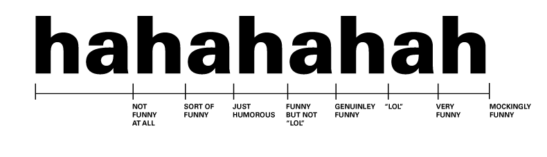

!SLIDE center
## Ruby és webprogramozás
## 02 – **Reguláris kifejezések**

### **Bácsi László a.k.a. *LacKac***
### [lackac.hu](http://lackac.hu) lackac@lackac.hu

!SLIDE code
# Alapok

    @@@ ruby
    # simple pattern
    /alma/
    
    # pattern with modifiers
    /alma/i
    
    # alternative syntaxes
    %r{alma}i
    %r|alma|i
    Regexp.new("alma", "i")

!SLIDE code
# Használat

    @@@ ruby
    # =~ operátor string és regexp összevetésére
    "Piros Alma" =~ /alma/i # => 6
    "piros bicikli" =~ /alma/ # => nil

    print "Email: "
    email = gets.chomp
    if email =~ /\w+@(\w+\.)+\w+/
      puts "Helyes email cím"
    else
      puts "Ez biztos nem jó email cím"
    end

!SLIDE code
# Speciális karakterek

    @@@ ruby
    # Speciális karakterek
    # . [ ] | ( ) { } + \ ^ $ * ?

    # . minden karakterre illeszkedik
    "BME" =~ /BM./          # => 0
    # [ ] minden karakterre, amit tartalmaz
    "BMF" =~ /BM[EF]/       # => 0
    # [^ ] vagy amit nem tartalmaz
    "BMF" =~ /BM[^E]/       # => 0
    # lehet benne range is
    "BME" =~ /B[A-Z][^a-z]/ # => 0

!SLIDE code

    @@@ ruby
    # | vagy kapcsolat
    "ELTE" =~ /BME|ELTE/  # => 0

    # ( ) csoportosítás
    "egyetem: BME" =~
      /(egyetem|főiskola): ([A-Z]+)/ # => 0

    # a zárójeles részeket "elkapja"
    $1 # => "egyetem"
    $2 # => "BME"

!SLIDE code

    @@@ ruby
    # * előző atom akárhányszor
    "hmmm" =~ /hm*/         # => 0
    "hehehe" =~ /(h[aei])*/ # => 0

    # + előző atom legalább egyszer
    "" =~ /(h[aei])*/       # => 0
    "" =~ /(h[aei])+/       # => nil
    "hehehe" =~ /(h[aei])+/ # => 0

    # alapból ezek greedy-k, de ezen ? változtat
    "said hmmm" =~ /(hm+)/; $1   # => "hmmm"
    "said hmmm" =~ /(hm+?)/; $1  # => "hm"

    # ? előző atom legfeljebb egyszer
    "egyetem BME" =~ /egyetem:? BME/ # => 0

!SLIDE code

    @@@ ruby
    # {n} pontosan n-szer
    "hmmm" =~ /hm{3}/   # => 0
    # {n,m} legalább n-szer, de legfeljebb m-szer
    "hmmm" =~ /hm{2,4}/ # => 0

    # ez is alapból greedy
    "hmmmmm" =~ /hm{2,4}/;  $&  # => "hmmmm"
    "hmmmmm" =~ /hm{2,4}?/; $&  # => "hmm"

!SLIDE center
# Feladat

### Írj egy ruby szkriptet, ami mond egy viccet, majd megkéri a usert, hogy nevessen rajta (írja be, hogy hahaha, vagy ilyesmi). Ez után a szkript derítse ki, hogy mennyire találtad viccessnek.

!SLIDE code

    @@@ ruby
    shopping_list = <<EOS
    Bevásárló lista:
    1 db nyúl
    25 db tojás ✓
    42 db 1 éves bárány
    EOS

    # ^ sor elejére, $ sor végére illeszkedik
    shopping_list.scan(/^\d+ .*$/)
    # => ["1 db nyúl", "25 db tojás ✓", "42 db 1 éves bárány"]
    shopping_list.scan(/^.* ✓$/)
    # => ["25 db tojás ✓"]

!SLIDE code

    @@@ ruby
    # \A, \z, \Z  string eleje, vége,
    # vagy vége de még newline előtt
    "egy\nkettő\n" =~ /\A(.*?)\Z(.*?)\z/m
    $~.captures # => ["egy\nkettő", "\n"]

    # \b szóhatár, \B nem szóhatár
    # \d számjegy (ugyanaz, mint [0-9])
    # \s whitespace (ugyanaz, mint [ \t\n\r\f])
    # \w szó karakter (ugyanaz, mint [0-9A-Za-z_])
    # \D, \S, \W ezek ellentetjei

!SLIDE code

    @@@ ruby
    # \1-9 n. csoport találata
    # \&   teljes találat
    "person people nation" =~ /\b(\w)\S*\1\S*\b/
    $& # => "people"

### [egyebek](http://www.zenspider.com/Languages/Ruby/QuickRef.html#11)

!SLIDE center smbullets
# Feladatok
### Arany János [*"A walesi bárdok"*](/file/gyakorlat-02/walesi_bardok.txt) c. verséből szedd ki:

* – az összes nagybetűs szót
* – a költemény születésének évét
* – az s betűvel kezdődő sorokat
* – az [alliterációkat](http://hu.wikipedia.org/wiki/Alliter%C3%A1ci%C3%B3#Bet.C5.B1r.C3.ADm_.28alliter.C3.A1ci.C3.B3.29)

!SLIDE code
# regexp-el használható metódusok

    @@@ ruby
    # .sub első találatot cseréli
    "lackac@lackac.hu".sub(/@/, ' alma ')
      # => "lackac alma lackac.hu"
    # .gsub az összes találatot cseréli
    "hahaha hehehe".gsub(/h[ae]/, 'hi')
      # => "hihihi hihihi"

    # felkiáltójeles változat
    e = "lackac@lackac.hu"; e.gsub!(/@/, '!')
    e # => "lackac alma lackac.hu"

!SLIDE code

    @@@ ruby
    # block-ot is képesek fogadni, ilyenkor
    # a block megkapja az illeszkedő sztringet
    # és a block visszatérési értékére cserél
    e = "lackac@lackac.hu lackac@math.bme.hu"
    e.gsub(/\w+@([\w.]+)/) { $1 }
      # => "lackac.hu math.bme.hu"

    "kics nagy".sub(/n[^ ]+/) {|m| m.upcase}
      # => "kics NAGY"

!SLIDE code

    @@@ ruby
    # .scan kiszedi az illeszkedő sztringeket
    "egy gyáva madár vágya".scan(/\S*gy\S*/)
      # ["egy", "gyáva", "vágya"]

    # ha van benne (), akkor azokat adja vissza
    shopping_list.scan(/^(\d+) .*$/)
      # [["1"], ["25"], ["42"]]

    # .split regexpek mentén darabol sztringet
    "Alice Bob,Carol, Dave".split(/[, ]+/)
      # ["Alice", "Bob", "Carol", "Dave"]

!SLIDE center smbullets
# Feladatok
### További walesi bárdokos feladatok

* – bontsd fel a költeményt verszakokra
* – csinálj a versből "tokaji bárdokat"

#### ([megoldások](/file/gyakorlat-02/megoldasok.rb))

!SLIDE smbullets
# Hasznos linkek

* **Online eszköz teszteléshez, tanuláshoz**:
[http://rubular.com/](http://rubular.com/)
* **Egy jó összefoglaló**: [http://www.regular-expressions.info/ruby.html](http://www.regular-expressions.info/ruby.html)
* **Quick Reference**: [http://www.zenspider.com/Languages/Ruby/QuickRef.html#11](http://www.zenspider.com/Languages/Ruby/QuickRef.html#11)
* **re by Jim Weirich**: [http://github.com/jimweirich/re](http://github.com/jimweirich/re)
