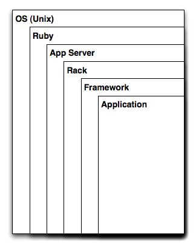

!SLIDE center
## Ruby és webprogramozás
## 05 – **Webprogramozás Sinatrával**

### **Bácsi László a.k.a. *LacKac***
### [lackac.hu](http://lackac.hu) lackac@lackac.hu

!SLIDE incremental smbullets center floated-image
# Egy alkalmazás környezet felépítése

* **OS**: Mondjuk Linux + Apache
* **Ruby**: Valamilyen Ruby interpreter
* **App Server**: Mongrel, Thin, Webrick
* **Rack**: Webalkalmazás absztrakciós réteg
* **Framework**: Rails, Sinatra, etc.
* **Application**: Hello World!

!SLIDE center code
# Rack

    @@@ ruby
    # hello_world.rb
    class HelloWorld
      def call(env)
        [200, {"Content-Type" => "text/plain"}, ["Hello world!"]]
      end
    end

    # config.ru
    require 'hello_world'
    run HelloWorld.new

!SLIDE smbullets center
# HTTP metódusok

### RESTfully

* **GET**: Valami lekérése
* **POST**: Valami létrehozása
* **PUT**: Valami módosítása
* **DELETE**: Valami törlése

#### De amúgy csak az első kettőt fogjuk használni...

!SLIDE code center with-background
# Hello, Sinatra!

    @@@ ruby
    require 'rubygems'
    require 'sinatra'

    get '/hi' do
      "Hello World!"
    end

!SLIDE code center
# Futtatás

    @@@ ruby
    # config.ru
    require 'app' # itt a fájl neve
    run Sinatra::Application

    $ rackup -p 900x

!SLIDE code center
# Paraméterek

    @@@ ruby
    get '/' do
      "<pre>#{params.inspect}</pre>"
    end

    get '/hi/:name' do
      "Hello #{params[:name]}"
    end

!SLIDE center
# Feladat

### Írj egy olyan webalkalmazást, ami a `/search/valami` kérésre visszaadja az előző gyakorlatban írt googler program segítségével a google találatokat a valami keresésre

#### Természetesen a "valami" dinamikus változó, bármi lehet.

!SLIDE smbullets
# Hasznos linkek

* **Sinatra**:
[http://www.sinatrarb.com/](http://www.sinatrarb.com/)
* [**HTTP** – Hypertext Transfer Protocol](http://en.wikipedia.org/wiki/Http)
