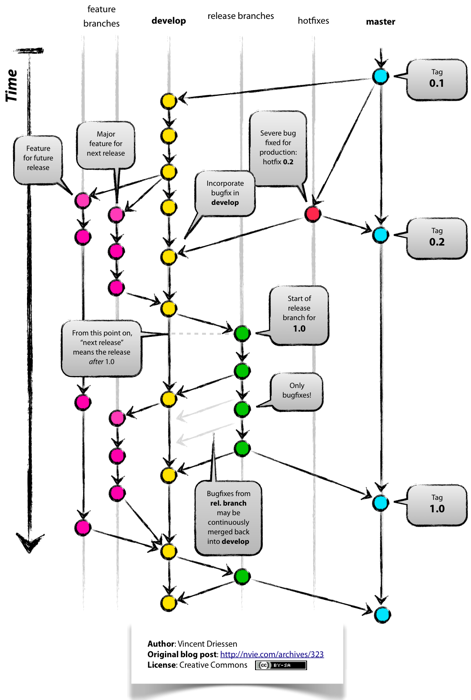

!SLIDE center
## Ruby és webprogramozás
### egy kis kitérő
## 07 – **Git**, **GitHub** és **Heroku**

### **Bácsi László a.k.a. *LacKac***
### [lackac.hu](http://lackac.hu) lackac@lackac.hu

!SLIDE center smbullets
# Mire való a verziókövetés

* **Biztonság**: megvan minden változtatás
* **Rend**: rendezettségre késztet
* **Kooperáció**: megkönnyíti a közös munkát
* **Szabadság**: könnyebbé teszi új dolgok kipróbálását

!SLIDE center smbullets
# Hagyományos verziókövetők

* egy központi *repository*
* sok hálózati forgalom
* nehezebb *branch* kezelés
* pl. SVN, CVS, Perforce

!SLIDE center smbullets
# Elosztott verziókövetők

* mindenkinél van egy lokális *repository*
* csak pár művelet igényel hálózati forgalmat (*sync*)
* nagyon egyszerű *branch*-ek létrehozása
* pl. Git, Mercurial, Bazaar

!SLIDE center smbullets smaller
# Git Alapfogalmak

* ***repository***: az összes verziót tartalmazó *adatbázis*
* ***branch***: egy fejlesztési ág
* ***master***: a fő fejlesztési ág
* ***working copy***: az jelenleg látott állapota a projektnek aktuális változtatásokkal együtt
* ***index***: commitolásra jelölt változtatások
* ***commit***: egy változtatás a projektben (érinthet több fájlt is, nevezhetjük *revision*-nek is)
* ***HEAD***: a legutolsó *commit* az aktuális *branch*-ben
* ***tag***: egy névvel ellátott *commit*
* ***remote***: távoli *repository*, amivel szinkronizálhatunk
* ***origin***: kitüntetett távoli *repository*

!SLIDE commandline
# Elindulás

    $ # használat: git parancs [argumentumok]
    $ git config --global user.name "László Bácsi"
    $ git config --global user.email "lackac@lackac.hu"
    $ git config --global core.editor 'vim' # vagy más
    $ cat ~/.gitconfig

    $ git help

!SLIDE center
# Fontosabb parancsok

!SLIDE commandline

    $# aktuális könyvtárból git repository készítés
    $ mkdir my_project
    $ cd my_project
    $ git init
    Initialized empty Git repository in ...

    $# el lehet kezdeni a fejlesztést
    $ echo "Ez itt az én kis projektem" > README

    $# git indexhez adunk fájlokat
    $ git add README
    $# vagy lehetne `git add .` és akkor
    $# mindent hozzáad rekurzívan

#### [az indexről bővebben](http://gitready.com/beginner/2009/01/18/the-staging-area.html)

!SLIDE commandline

    $# working copy aktuális állapota
    $ git status
    $# új fájlt hozunk létre, akkor mi lesz?
    $ echo "require 'rubygems'" > app.rb
    $ git status

    $# becommitoljuk az index tartalmát
    $ git commit -m "Commit üzenet"
    $ echo "változás" >> README
    $ git status
    $# minden már követett és módosult fájl commitolása
    $ git commit -a
    $ git status

!SLIDE commandline

    $# projekt eddigi története
    $ git log
    $ git log -p
    $# változtassunk megint valamit
    $ echo "még egy változás" >> README
    $# nézzük mi változott az utolsó commit óta
    $ git diff

!SLIDE center
# Git Branch-ek

!SLIDE center

!SLIDE commandline

    $# új branch létrehozása
    $# aktuális ponton csinál egy új ágat
    $ git checkout -b branch_neve
    $# milyen branch-ek vannak
    $ git branch
    $# aktuális változások is átjöttek
    $ git status
    $ git add .
    $ git commit -m "minden mehet be"

!SLIDE commandline

    $# vissza a master ágba
    $ git checkout master
    $# mergeöljük össze a két ágat
    $ git merge branch_neve
    $# nincs hiba, minden itt van, `branch_neve` törölhető
    $ git branch -d branch_neve

!SLIDE commandline
# Szinkronizálás

### Klónozás

    $ git clone git@github.com:lackac/bme-math-webprog.git

### Változások kirakása és leszedése

    $ git push origin master
    $ git pull origin master

!SLIDE commandline smaller
# Ismétlés
### argumentumok nélkül... további helphez `git parancs -h` vagy `git help parancs`

    $ git init            # új repó
    $ git clone           # távoli repó klónozás
    $ git add             # fájlok indexhez adása
    $ git status          # working copy állapota
    $ git commit          # index commitolása
    $ git commit -a       # minden módosult követett fájl commitolása
    $ git log             # commit history
    $ git diff            # változások utolsó commit óta
    $ git push            # lokális repó változások kirakása
    $ git pull            # távoli repó változások behúzása
    $ git checkout -b     # új branch létrehozás
    $ git checkout        # branchek között váltás (de más is)
    $ git branch          # összes lokális branch

!SLIDE commandline
# Amik nem voltak

    $ git rebase
    $ git stash
    $# és még sok más...
