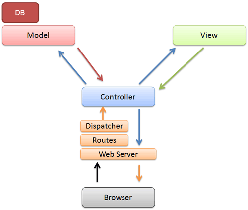

!SLIDE center
## Ruby és webprogramozás
## 10 – Sequel Model és Migration

### **Bácsi László a.k.a. *LacKac***
### [lackac.hu](http://lackac.hu) lackac@lackac.hu

!SLIDE center
# MVC

!SLIDE center
# Sequel::Migration

    @@@ ruby
    # db/01_create_users_table.rb
    class CreateUsersTable < Sequel::Migration
      def up
        create_table :users do
          primary_key :id
          String :login
          String :password_hash
          String :name
          Time :created_at
        end
      end

      def down
        drop_table :users
      end
    end

!SLIDE center commandline incremental
# Migration futtatása

### `sequel -m <migration könyvtár> [-M <verzió>] <db uri>`

    $ sequel -m db sqlite://app.db
    # egy adott verzióra visszaállás
    $ sequel -m db -M 3 sequel://app.db

!SLIDE center
# Sequel::Model

    @@@ ruby
    # user.rb
    class User < Sequel::Model
    end
    # feltételezi, hogy a hozzá tartozó tábla neve `users`
    # ha nem az lenne, akkor fenti helyett:
    # class User < Sequel::Model(:my_users)
    # end

    # keresés primary key alapján
    user = User[42]
    user.pk # => 42

    # egyéb kritérium alapján
    user = User[:login => "LacKac"]
    user = User.find {|u| u.age > 18}

!SLIDE center
# Attribútumok

    @@@ ruby
    user.values # => {:id => 42, :login => "LacKac", ...}
    user.id # => 42
    user.login # => "LacKac"

    # módosítás
    user.name = "Bácsi László"
    # vagy
    user.set(:name => "Bácsi László")

    # ez még nem menti el, azt külön kell meghívni
    user.save

    # vagy lehet egyből menteni is
    user.update(:name => "Bácsi László")

!SLIDE center
# Új létrehozás

    @@@ ruby
    user = User.create(:login => "calvin", :name => "Kázmér")

    # vagy bőbeszédűbben
    user = User.new
    user.login = "calvin"
    user.name = "Kázmér"
    user.save

!SLIDE center
# Törlés

    @@@ ruby
    user.delete   # kihagyja az eseménykezelést
    user.destroy  # futtat eseménykezelőket

    # többet is lehet egyszerre
    Note.filter {|n| n.note.length > 250}.delete

!SLIDE center
# Iterálás, kollekció manipulálás

    @@@ ruby
    users = User.filter {|u| u.created_at < (Time.now - 86400)}
    users.delete

    notes = Note.filter(:note.like(/túró rudi/i))
    notes.update(:category => "chocolate")

!SLIDE center
# Asszociációk (relációk)

    @@@ ruby
    class Note < Sequel::Model
      many_to_one :user
      # one_to_many :comments
      # many_to_many :tags
    end

!SLIDE center smbullets
# További témák

* többi asszociáció típus
* eager loading
* dataset metódusok
* hook-ok
* validáció

!SLIDE smbullets
# Hasznos linkek

* **[Sequel Models](http://sequel.rubyforge.org/rdoc/files/README_rdoc.html)** (oldal közepe felé)
* **[Sequel séma és migráció](http://sequel.rubyforge.org/rdoc/files/doc/schema_rdoc.html)**
